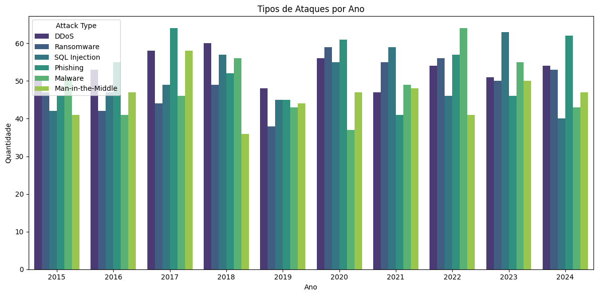

# 🌐 Cybersecurity-Dataframe-Analysis

# 🚀 Sobre o Projeto
O objetivo deste projeto é permitir a aplicação dos conhecimentos de análise de dados estatísticos provenientes de um determinado **Data Frame**, utilizando a biblioteca **Pandas** para a análise de dados e o **Streamlit** para a exibição de Dashboards interativos.

## 📂 Sobre o Data Frame
O Data Frame em questão consiste em registros de ameaças cibernéticas globais ocorridas entre os anos de 2015 e 2024. O Data Frame é proveniente do Kaggle e você pode acessa-lo por [aqui](https://www.kaggle.com/datasets/atharvasoundankar/global-cybersecurity-threats-2015-2024).

O Data Frame está dividido da **seguinte maneira**:

| Nome da Coluna                      | Descrição                                               |
|-------------------------------------|---------------------------------------------------------|
| Country                             | País onde ocorreu o ataque                              |
| Year                                | Ano do incidente                                        |
| Attack Type                         | Tipo de ameaça (ex.: Malware, DDoS)                     |
| Target Industry                     | Setor alvo (ex.: Financeiro, Saúde)                     |
| Financial Loss (in Million $)       | Perda financeira estimada (em Milhões de dólares)       |
| Number of Affected Users            | Número de usuários comprometidos                        |
| Attack Source                       | Fonte de ataque (Hacker Group, Unknown)                 |
| Security Vulnerability Type         | Tipo de vulnerabilidade de sistema                      |
| Defense Mechanism Used              | Tipo de mecanismo de defesa utilizado como contramedida |
| Incident Resolution Time (in Hours) | Tempo de resolução do problema (em Horas)               |

## 🔍 Escolha do Data Frame
A escolha deste Data Frame foi baseada em sua **estrutura bem definida**, **variedade de atributos** e **visualização de dados**.

Cobrindo um período de 10 anos (2015 a 2024) e contém 10 colunas com informações variadas.

> O Data Frame também esta livre de dados ausentes e duplicações.

# 🧐 Entendimento Inicial do Data Frame
## 🔍 Verificações Básicas
```python
df.info() # Informações Básicas
df.describe() # Principais Infos Estatísticas
df.shape # Quantidade de linhas e colunas
```
## 🩹 Tratamentos Iniciais
```python
df.isnull().sum() # Valores Nulos
df.duplicated().sum() # Valores Duplicados
df['Colunas Nominais'].unique() # Verificação de intercorrencias em cada coluna
```
# 🔬 Análise Exploratória de Dados
## ➕ Estatísticas Descritivas
Obtenção de resultados a partir do método `df.describre()`.
## 👀 Visualizações Básicas
Uso da biblioteca `seaborn` para plotagem de gráficos básicos sobre os dados presentes no Data Frame.
### Exemplo:


# 🔧 Tratamento de Dados
## 😵‍💫 Identificação Problemas e Criação da Coluna `Severity`
A base de dados **não possuia presença de nenhum dado faltante ou duplicado**.
Em função disso as etapas de atribuição de novos dados a partir de métricas estatísticas não foi possível. Entretanto, foi criada uma nova Coluna chamada `Severity` que calcula a severidade do ataque cibernético registrado baseado nos valores estatísticos das colunas `Financial Loss` e `Number of Affected Users`.

# 🧠 Planejamento do Dashboard

## 🎯 Visualizações que serão incluídas

O dashboard foi projetado utilizando a ferramenta **streamlit** e serve para exibir os principais aspectos de ataques cibernéticos entre 2015 e 2024. Gráficos presentes:

### Dividios por `st.tables`
- **📈 Métricas Gerais**: total de incidentes, perdas financeiras e número de usuários afetados.
- **🕒 Gráfico de linha**: evolução dos incidentes ao longo dos anos.
- **💸 Gráfico de barras**: perda financeira por país.
- **📊 Gráfico de barras horizontais**: setores mais afetados.
- **🕒 Gráfico de linha**: tempo médio de resolução dos incidentes
### Divididos por `st.columns`
- **🦠 Gráfico de pizza**: tipos de ataque mais frequentes.
- **🤖 Gráfico de barras horizontais**: principais fontes de ataque.

## 📊 Escolha das visualizações que transmitam efetivamente as informações relevantes

As visualizações foram escolhidas com base na clareza e impacto visual dos dados:

- **Linhas** para séries temporais.
- **Barras** para comparações diretas entre categorias.
- **Pizza** para proporções simples.
- **Mapa** para localização geográfica dos incidentes, facilitando a análise por região.
- **Métricas resumidas** no topo para fornecer uma visão geral imediata.

---

# 🚀 Criação do Dashboard

## 🧰 Streamlit

O Streamlit foi escolhido por sua facilidade e agilidade para criação de dashboards interativos, permitindo foco na análise de dados sem complexidade excessiva.

### Funcionalidades Utilizadas:

- `st.title()` e `st.subheader()` para estruturar o layout.
- `st.sidebar.multiselect()` para filtros interativos.
- `st.columns()` para exibição de métricas.
- `st.plotly_chart()` para gráficos dinâmicos com Plotly.
- `st.cache_data` para otimização no carregamento de dados.

## 🧪 Implementação de Filtros para exploração dinâmica dos dados

Os seguintes filtros foram implementados na `sidebar`:

- **Filtro por ano**: permite selecionar múltiplos anos entre 2015 e 2024.
- **Filtro por país**: permite selecionar múltiplos países.
- **Filtro por tipo de Ataque**: Permite selecionar qual foi o tipo de ataque ocorrido (ex.: Malware, DDoS, Phising, etc.)

Esses filtros afetam diretamente os dados exibidos nas visualizações, permitindo ao usuário personalizar a análise conforme o contexto desejado.

---
